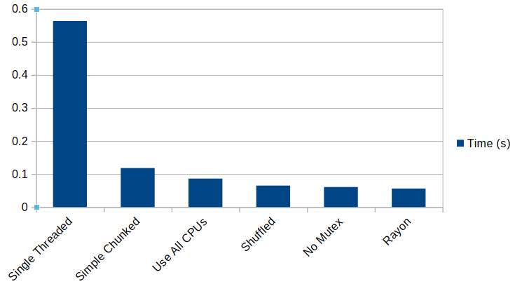

# Threads Wrap-Up

So we've been through some theory, and workshopped our way through optimizing a computational problem with threads (rather than fixing the algorithm - which is generally a better idea!).

Looking at the performance chart:

* Using threads for CPU bound workloads is a big win.
* Tweaking the thread system is a much smaller win.
* Understanding our data-set and workload made a difference.
* Rayon is amazing, and if you can use it---it's well worth doing so.

We've also learned:

* Rust is amazing at threading.
* While the code is complicated, it is *much* less prone to mistakes than the equivalent in other languages.
* Knowing that we won't be able to compile a silly mistake makes it much easier to not fear concurent programming.

