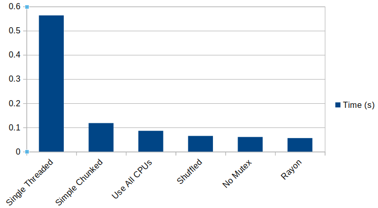

# Oh yeah, Rayon

I mentioned that a lot of multi-threading problems can be reduced to some really simple code with Rayon. So let's give it a go for this problem:

```rust
use std::time::Instant;
use rayon::prelude::*;

const MAX_NUMBER: usize = 100_000;

/// Really inefficient prime number calculator
fn is_prime(n: usize) -> bool {
    if n <= 1 {
        false
    } else {
        for div in 2..n {
            if n % div == 0 {
                return false;
            }
        }
        true
    }
}

fn main() {
    let candidates: Vec<usize> = (0..MAX_NUMBER).collect();

    // Perform the calculation
    let start = Instant::now();
    let primes = candidates
        .par_iter()
        .filter(|n| is_prime(**n))
        .map(|n| *n)
        .collect::<Vec<usize>>();
    let elapsed = start.elapsed();

    // Results
    println!("Found {} primes", primes.len());
    //println!("{:?}", primes);
    println!("Calculated in {:.4} seconds", elapsed.as_secs_f32());
}
```

And the results?

```
Found 9592 primes
Calculated in 0.0560 seconds
```

Giving a final table:

Test | Threads | Time (seconds)
-|-|-
Single Thread | 1 | 0.5633
Simple Chunked | 10 | 0.1180
Use All CPUs | 20 | 0.0861
Shuffled | 20 | 0.0649
No Mutex | 20 | 0.0606
Rayon | 20 | 0.0560



So how does Rayon achieve a slightly better speed, after all our optimization? Rayon fires up its thread pool at the beginning, so we're not timing the penalty for making the threads! It also uses a function to generate the chunks in parallel.